## Vehicle detection : Writeup
---

**Vehicle Detection Project**

The goals / steps of this project are the following:

* Perform a Histogram of Oriented Gradients (HOG) feature extraction on a labeled training set of images and train a classifier Linear SVM classifier
* Optionally, you can also apply a color transform and append binned color features, as well as histograms of color, to your HOG feature vector. 
* Note: for those first two steps don't forget to normalize your features and randomize a selection for training and testing.
* Implement a sliding-window technique and use your trained classifier to search for vehicles in images.
* Run your pipeline on a video stream (start with the test_video.mp4 and later implement on full project_video.mp4) and create a heat map of recurring detections frame by frame to reject outliers and follow detected vehicles.
* Estimate a bounding box for vehicles detected.

The Rubric Points can be found [here](https://review.udacity.com/#!/rubrics/513/view). 

---

### Histogram of Oriented Gradients (HOG)

#### Explain how (and identify where in your code) you extracted HOG features from the training images.

<i>Code in section 1.3 to 1.4</i>

[Jeremy Shannon](https://github.com/jeremy-shannon/CarND-Vehicle-Detection/blob/master/vehicle_detection_project.ipynb) has provided in his GitHub an insightful study of the influence of the parameters of the ``get_hog_features`` function. He has chosen YUV color space,	11 orientations, 16 Pixels Per Cell,	2 Cells Per Block, and to use ALL of the color channel. It provided him a 98,17% accuracy and 55,22 s extracting time for the entire dataset. Its comparison can be found in his GitHub. 

As concluded by this [document](https://www.researchgate.net/publication/224200365_Color_exploitation_in_hog-based_traffic_sign_detection) (which analyzed the affect of color spaces for traffic sign classifiction), YCrCb and CIELab color spaces perform well. YUV shares similitudes with YCrCb ([Tushar Chugh](https://github.com/TusharChugh/Vehicle-Detection-HOG/blob/master/src/vehicle-detection.ipynb)) making YUV a good candidate as shown by different medium articles. 

From [Tushar Chugh](https://github.com/TusharChugh/Vehicle-Detection-HOG/blob/master/src/vehicle-detection.ipynb) I concluded that color histogram and spatial histogram does not provide strong accuracy improvement and reduce the extracting time. Thus, they little improvement is not a strong asset in this case. 

In the case of extraction feature for autonomous driving the accuracy is as important as the extraction time. Hence, the choice of Jeremy Shanon was logic, but I think it might be interesting to investigate another parameter set which provide great extracting time and great accuracy even if they are not the best. Jeremy Shannon didn't apply data-set enhancement which could provide an accuracy improvement. The used parameter set bring a 1,52% accuracy decrease and 13,19 s improvement meaning the data enhancement should compensate the accuracy drop to be efficient (this assumption revealed to be not true due to overfitting). 

After some experimentation, the LAB colorspace doesn't work as well as YUV or YCrCb, hence I continued with YUV. The orientation effect the calculation, I have found 12 possible gradient orientations is great trade off between performance and speed. I haven chosen as well 8 pixel per block pix_per_cell = 8 and cell_per_block = 2. 

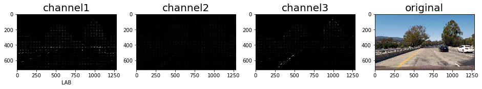
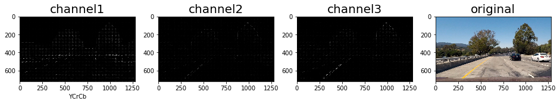

#### Describe how you trained a classifier using your selected HOG features

<i>Code in section 1.5 to 1.6</i>

First, ```car_feature``` and ```notcar_feature``` are combined vertically. The created vetor is then scaled using ```StandardSacler``` (it removes the mean and provide a unit variance of the dataset). The result vector is created and  combined horizontally to feature vector. The test and validation are then created randomly with 20% proportion and shuffle as well.

The SGDC classifier is variant of a linear support vector machine model and were used in the project. I have tested Naive Bayes and decision three model, which have shown to have similar accurcy results. The special SGDC provided however an improved training time for the same accuracy, therefore I prefered using the SDGC insteaf of the other.

### Sliding Window Search
<i>Code in section 1.7</i>

#### Sliding window implementation

```Find_car``` is a function which extracts hog features of an entire image than apply a sliding windows technic to this HOG image. Each frame taken appart from the sliding windows is analyzed by the SDGC classifier to predict whether the frame is a vehicle or not. If the frame reveals to be a car, the the boxes coordinates of the predicted vehicle are calculated and returned by the the function. An image with the boxen vehicle is also returned. 

The function ```apply_sliding_window``` is in charge to apply the ```Find_car``` sliding window method using multiple window sizes which allow the procedure to be scale proof. 

The y start and stop position are use a band where the sliding window technic is applied. It allows to focus on a ROI. The scaled of the sliding window is find to fit a entire car in the frame. 

I am facing a computation duration problem : computing the sliding window technic takes 15s per images, involving a tremedous amount of time to compute an entire video. This problem should be solved, but I except reducing the the number of window... 

Even if the classifier provides a great accuracy, the amount of false positive and negative is still high. Increasing the the ROI and adding sliding window search wasn't viable due to the really high time of computation. The color histogram might avoid those false positive, therefore this possibility should be tested in order to improve the robustness of the classification. 

![alt text][image3]

#### Example processed image
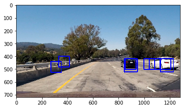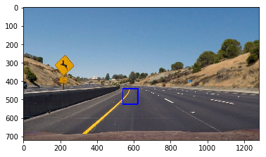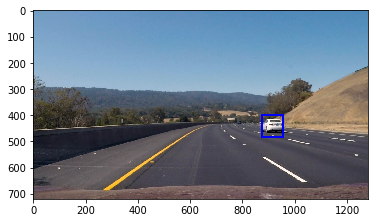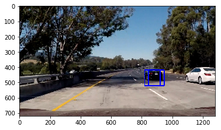
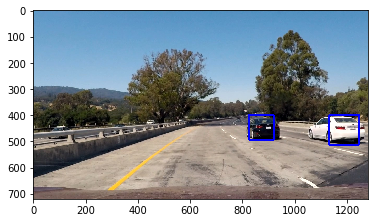
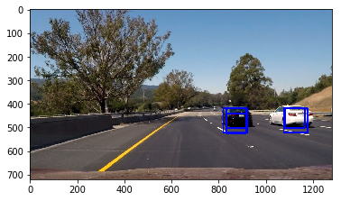

### Video Implementation

#### Heatmap to filter the false positive

To avoid false postive, a heat map is used. The principle is the following, first a map is create, zero array-like of the analyzed image size. Once, a car is detected and box is found, the boxen area of image is added by 1 on the same region of the array. Therefore, when a zero on the heat means that no car has ever been found in the process. When its values is one, a vehicle have been found once and when the value is greater than one, a vehcile have been multiple times. The heatmap thus a measure of certainty of the prediction. Applying a treshold of 1, meaning we consider that the confidence of unique positive prediction is this area is not enough, allow one to filter the false positves.


<i> Code is in section 1.8 </i>

##### Some example of the heatmap process

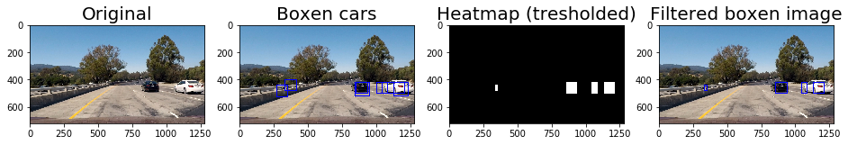
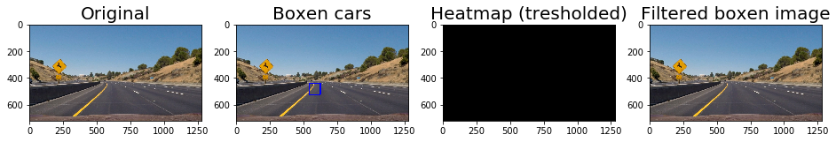
(Highlights that the filetering technic can reject true prediction as well)
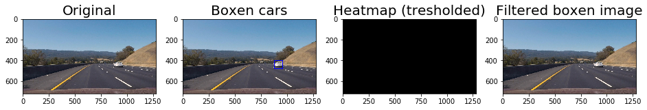
#### Pipline implementation

The pipline combine all the functions written in order work together. It applies multiple scale of sliding window, filter the boxen images using a heatmap, rebound new boxes based on the labeling of the heatmap and then draw the boxes on the image. 

<i> Code is in section 1.9 </i>
#### Link to the final video output.  
    
Here's a [link to my video result](https://www.youtube.com/watch?v=Gt2ZO6IfRfo&feature=youtu.be).

It is clear that the result is not perfect. However, the computation time of 6 hours was limiting the debugging. 

---

### Discussion


* The computation is clearly too long and is due to an overuse of sliding window research. An improvement would be to focus on more specific part on the image, and instead of working in a band (y limitation), it might be interresting to implement research area region limite by x start and stop + y start and stop. 
* There is still false positives that are predicted and unfiltered in the output video. It is due to a wrong threshold value of the heatmap filtering. Increasing the treshold may lead to reject right predictions. Therefore, more boxes of the car objects should be computed to improve the predictions and the filtering. This could be achieved by increasing the number of sliding operation and scale. Nevertheless, this comes with the price of computation performance decrease. False postive could be improved by getting a better robustness of the classifier, this can be realized by providing a large feature vector for training and predicting. There, it might finally be interresting to integrate color features. 
* The generated boxes are wiggling around the wars. This is due to the labeling process which does not receive enough incoming boxes to find a fine boxe around the actual car. Point 1 and 2 improvement should improve this problem as well. 
* The filtering could be improved as well ; Car does not disappear in the center of the image from one frame to the next. Thus the boxes variations could be weighted to make a better fit from a frame to another. Moreover, as applied in the previsous project, we could generate some area where the probability of finding a car is high beacuse in the previous frame a predicted car was around. 
* Applying sliding window of different scales and different regions is a serial process, there should be a way to use parallel processing for speed enhancement. 
